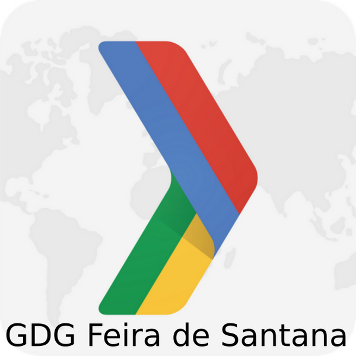

<h1 align="center">
  
</h1>

<h3 align="center">
    GDG Community Manager App
</h3>

</img>

<a href="LICENSE.md">
    </img>
</a>

<a href="LICENSE.md">
    </img>
</a>

## :computer: Sobre

O GDG Community Manager App é um projeto que tem como objetivo auxiliar os GDG's de todo o mundo a organizar seus eventos de comunidade, ajudando na gestão do público, patrocinadores e custos do evento. Esse é um projeto OpenSource ainda em desenvolvimento.

## :gear: Tecnologias

Esse projeto está sendo desenvolvido com as seguintes tecnologias:

- [Laravel](https://laravel.com/)
- [React](https://reactjs.org)

## :memo: Licença

Esse projeto está sob a licença MIT. Veja o arquivo [LICENSE](LICENSE.md) para mais detalhes.

## :phone: Contato

Para dúvidas ou sugestões, as issues e pull requestes são sempre bem vindos, ou me envie uma mensagem pelo Discord (MarceloBiao#6673) para que possamos conversar :grin:.
